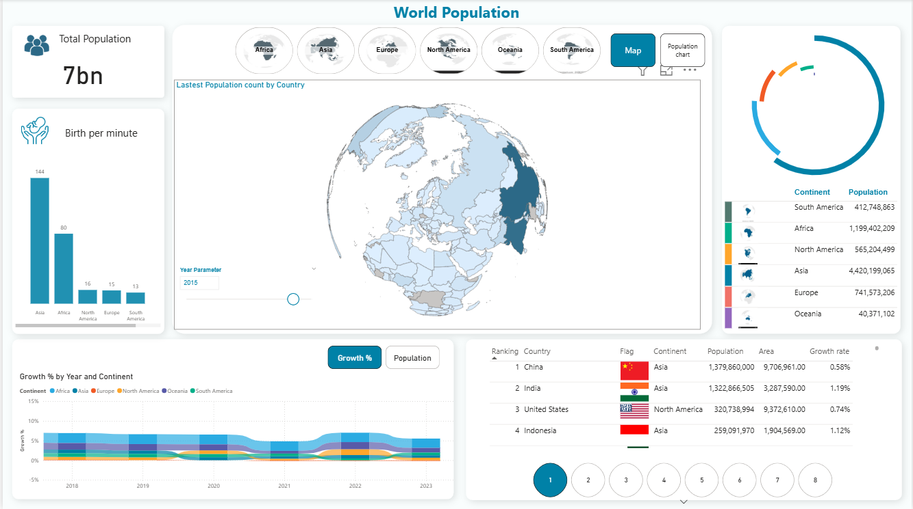

# 🌍 World Population Dashboard - Power BI

This project is an **interactive Power BI dashboard** that visualizes **global population data** by continent, country, and year.  
The dashboard provides insights into **population size, growth trends, birth rates, and country-level breakdowns**.

---

## 📊 Features Included

### 1. **Total Population Overview**
- Displays the **global population (7 billion)**.
- Shows **births per minute** across continents:
  - Asia: 144
  - Africa: 80
  - North America: 16
  - Europe: 15
  - South America: 13

### 2. **Population by Continent**
- Interactive **donut chart** showing the population share of each continent.
- Values included:
  - **Asia**: 4.42B  
  - **Africa**: 1.19B  
  - **Europe**: 741M  
  - **North America**: 565M  
  - **South America**: 412M  
  - **Oceania**: 40M  

### 3. **World Map Visualization**
- Interactive **map view** to see the population distribution by country.
- Ability to filter by **continent** (Asia, Africa, Europe, North America, South America, Oceania).
- **Year Parameter** slicer (example: 2015) to analyze trends by time.

### 4. **Growth % by Year and Continent**
- A line + stacked area chart showing **population growth rate (%)** across continents from **2018 to 2023**.
- Helps analyze **which continents are growing fastest** and compare regional differences.

### 5. **Country Ranking Table**
- A sortable table showing:
  - **Ranking** by population
  - **Country name & flag**
  - **Continent**
  - **Population count**
  - **Area (km²)**
  - **Growth rate (%)**
- Example:
  - **China**: 1.37B (0.58% growth)
  - **India**: 1.32B (1.19% growth)
  - **USA**: 320M (0.74% growth)
  - **Indonesia**: 259M (1.12% growth)

---

## 🛠 Tools & Technologies
- **Power BI Desktop**
- DAX (Data Analysis Expressions) for calculations
- Interactive filters, slicers, and drill-through functionality
- Data modeling for year-over-year analysis

---

## 🚀 How to Use
1. Open the `.pbix` file in **Power BI Desktop**.
2. Interact with:
   - **Map filters** (continent/country)
   - **Year slicer**
   - **Growth % trends**
   - **Population ranking table**
3. Explore insights across **continents, countries, and years**.

---

## 📌 Insights from Dashboard
- **Asia** is the most populated continent with over **4.4B people**.
- **Africa** shows the **highest growth rate**, indicating future population expansion.
- **China & India** together account for more than **2.7B people**, nearly 40% of the world.
- **Birth rates** are highest in **Asia and Africa**, driving overall population growth.

---

## 📷 Screenshot

---

## 📂 Project Files
- `World_Population_Report.SS.png` → Dashboard Screenshot
- `World_Population.pbix` → Power BI file (if shared)

---

## ✨ Author
Created by **[Your Name]**  
Power BI | Data Analytics | Visualization
